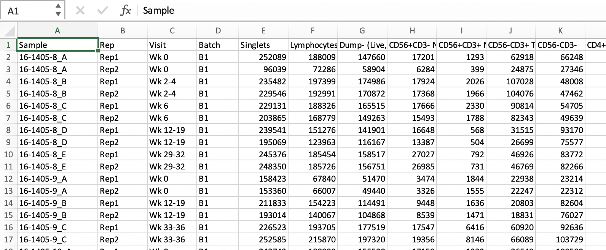

```{r setup, include=FALSE}
knitr::opts_chunk$set(echo = TRUE)
library(tidyverse)
library(kableExtra)
library(edgeR)
```

# Data Preparation from FlowJo 

## Rawdata Analysis
Analyses FCS file as standard precedures (Use Isotype or FMO for gating). Label population well (population name will be used to generate the names for the exported files). Isotype or FMO is not needed for downstream analysis in R. 

Note that all FCS files should be named following certain patterns for automatic seperation of meta information such as `Sample, Timepoint, Rep`....    

## Export Population Statistics to Excel
* Export the population count to Excel as the **current IMF analysis SOP**.     
**Note: the first a few consequetive column should be experiment design covariates, such as sample name, rep, batch....**    

{width=700px}

# Data Analysis in R
## Readin Files to R 


```{r, echo=F}
df <- read.csv("../inst/data/sample_data.csv")
head(df)%>%
  kable()%>%
  kable_styling()%>%
  scroll_box(height = "300px")
```

## Generate Metadata     
For example we have 5 patient and 3 timepoints for each patient in this `Experiment Design`     
**Note: manual category can be labeled such as responder vs non responder, before or after treatment**    
**Note: Replication is not part of the experiment design, the two replicates were average and the association of the two replicated were used as weighting factoring in the downstream differential analysis. low repreducability contributes less)**     
```{r, echo=F}
meta.data <- df[, 1:4]%>% mutate_if(is.character, as.factor)
meta.data$Patient <- factor(gsub("_.*", "", meta.data$Sample))
meta.data$Visit <- factor(meta.data$Visit, levels = c("Wk 0", "Wk 2-4", "Wk 6", "Wk 12-19",  "Wk 25-28", "Wk 29-32", "Wk 33-36" ))

meta.data%>%summary()
```


## Filtering Counts Data
The analysis is mainly interested in counts,  counts per population of the technical replicate will be combined. (If there is concern of the data quality one should manually noted.)    

Filter out a population with per patient count less than 200. (this parameter can be customized)    

```{r}
counts <- as.matrix(t(df[, c(5: ncol(df))]))

# sum up replicates
y <- DGEList(counts, samples = meta.data)
y <- sumTechReps(y, ID = meta.data$Sample)

design <- model.matrix(~ Visit + Patient, data = y$samples)


# keep population that has at least 200 cells
keep <- filterByExpr(y, group = meta.data$Patient, min.count = 200)
y <- y[keep, , keep.lib.sizes = FALSE]
y <- calcNormFactors(y)
```

**Exploratory PCA can be done:**        
```{r}
PCA <- prcomp(t(y$counts))

data.frame(PCA$x[, 1:2],
             y$samples) %>%
  ggplot(aes(PC1, PC2, color = Patient))+
  geom_point()+
  geom_text(aes(label = Sample))+
  theme_classic()+
  theme(legend.position = "bottom")
```

## Set up Design and Contrast    
Set up design matrix in control of random effect per sample, and condations of interests.    
For example, here we $~ Visit + Sample + Batch$ can check differential abundance between visit, while adjust the batch effect and sample random effect. Customized level such as before or after treatment or responder and non-responder can be checked.    

Below is the design of models that are avaliable for differential test:    
```{r}
colnames(design)[1:7]

```
We will be using baseline as the reference level, checking each of the visits comparing to baseline. (Extra test can also be done by doing paired test between any two Visits.)    

## Differential Analysis   

```{r}
y <- estimateDisp(y, design = design, trend.method = NULL, robust = T)
fit <- glmFit(y, design = y$design)

res <- list()
for (i in 2:7) { 
  contrast <- rep(0, ncol(y$design))
  contrast[i] <- 1 # set contrast
  lrt <- glmLRT(fit, contrast = contrast)
  top <- edgeR::topTags(lrt, n = Inf, adjust.method = "BH", sort.by = "none")
  
  res[[colnames(y$design)[[i]]]] <- top[top$table$PValue < 0.05 & top$table$FDR < 0.2, ]
  }


```

