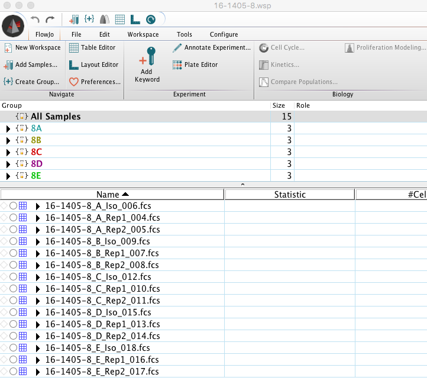
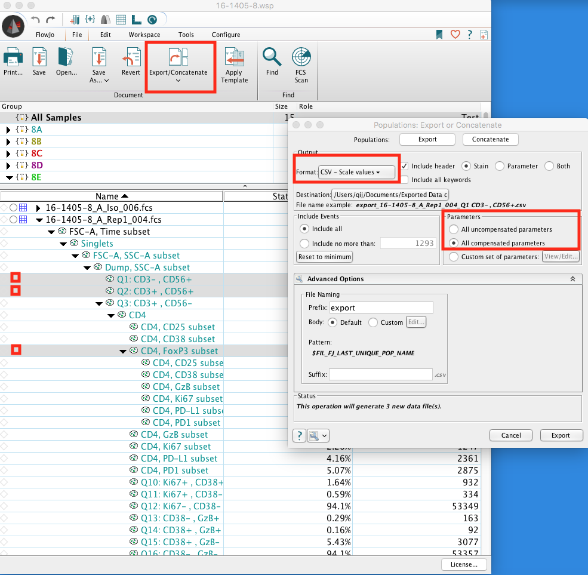
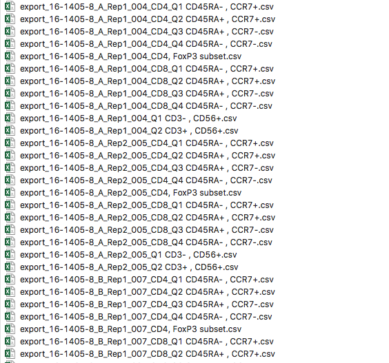

```{r setup, include=FALSE}
knitr::opts_chunk$set(echo = TRUE)
library(tidyverse)
library(kableExtra)
library(limma)
```

# Data Preparation from FlowJo 

## Rawdata Analysis
Analyses FCS file as standard precedures (Use Isotype or FMO for gating). Label population well (population name will be used to generate the names for the exported files). Isotype or FMO is not needed for downstream analysis in R. 

Note that all FCS files should be named following certain patterns for automatic seperation of meta information such as `Sample, Timepoint, Rep`....    


## Export Population of Interest
* In flowjo interface, select the population of interest, (in the latest version, one can select multiple population at the same time, as long as the population is well labeled to be able to distinguish from each other.)    
* In flowjo file menu, select `Export`---> `Format`: CSV-Scale values (this is in log scale) ---> `Parameters`: All compensated parameters (simply include all compensated marker channels for downstream analysis) --> `Export`. as shown below:    

**Preferably avoid exporting overlapping populations, unless having special reasons (for example export CD3+ and CD3+CD4+ at the same time, since every datapoint will be exported, this generat files with repeated information)**    

{width=700px height=900px}
 
    
* Example of exported files below. We would inspect marker expression in `FoxP3+ CD4+, 4 memory populations of CD4+ and 4 memory populations of CD8+`
Other populations of interest can also be exported depends on the flow pannel's focus.    



# Data Analysis in R
## Readin Files to R 

```{r, echo=F}
f_ls <- list.files("~/Documents/Exported Data c", full.names = T)

f_name <- sapply(strsplit(f_ls, split = "/"), function(x) x[6])

f_pop <- sapply(strsplit(f_name, split = "_"), function(x){
  temp <- gsub("_NA", "", paste(x[6], x[7], sep = "_"))
  gsub(".csv", "", temp)
})


f_sample <- sapply(strsplit(f_name, split = "_"), function(x) x[2])
f_timepoint <- sapply(strsplit(f_name, split = "_"), function(x) x[3])
f_rep <- sapply(strsplit(f_name, split = "_"), function(x) x[4])

col_data <- data.frame(sample = f_sample,
                       timepoint = f_timepoint,
                       #rep = f_rep,
                       #population = f_pop,
                       rep_pop = paste(f_pop, f_rep, sep = ";"))

col_data %>%
  kable()%>%
  kable_styling()%>%
  scroll_box(height = "300px")

csv_ls <- lapply(f_ls, function(x) read.csv(x))
#colnames(csv_ls[[1]])
marker_stat <- c("Ki67", "PD.L1", "PD1", "GzB", "CD25", "CD38")
```

## Use File Names to Generate Metadata     
For example we have 5 patient and 3 timepoints for each patient in this `Experiment Design`     
**Note: manual category can be labeled such as responder vs non responder, before or after treatment**    
**Note: Replication is not part of the experiment design, the two replicates were average and the association of the two replicated were used as weighting factoring in the downstream differential analysis. low repreducability contributes less)**     
```{r, echo=F}
#median all
med <- t(sapply(csv_ls, function(x) (apply(x, 2, median))))

#cellcount
pop_counts <- cbind(col_data,
                    counts = sapply(csv_ls, function(x) nrow(x))) %>%
  spread(key = "rep_pop", value = "counts")

n_pop <- length(unique(col_data$rep_pop))
design <- pop_counts[, 1 : (ncol(pop_counts)- n_pop)]
pop_counts <- t(pop_counts[, (ncol(pop_counts)- n_pop + 1) : ncol(pop_counts)])

design %>%
  kable()%>%
  kable_styling()%>%
  scroll_box(height = "300px")
```

## Set Contrast of Conditions for Differential Analysis    
For the `Experiment Design` levels avaliable are: `"(Intercept)", "sample16-1405-12", "sample16-1405-13", "sample16-1405-8",  "sample16-1405-9",  "timepointB",       "timepointC"`    
here The reference level(Intercept) is: `sample16-1405-10` and `timepoint A`, (this can be change as desired).    
The contrast allow one to compare the mean of groups, essentially it is a oneway or twoway ANOVA setting among conditions, which means one can compare either two levels listed above.         

```{r, echo=F}
med_ls <- list()
for (i in marker_stat) {
  temp <- cbind(col_data, 
        marker = med[, i]) %>%
    spread(key = "rep_pop", value = "marker") 
  n_pop <- length(unique(col_data$rep_pop))
  med_ls[[i]] <- t(temp[, (ncol(temp)- n_pop + 1) : ncol(temp)])
}

# check levels avaliable for contrast setting
#colnames(design)

formula <- as.formula(paste("~", paste(c("sample", "timepoint"), collapse = " + ")))
design <- model.matrix(formula, data = design)

contrast <- matrix(c(rep(0, 6), 1), ncol = 1)
rownames(contrast) <- colnames(design)

t(contrast)
```

## Differential Expression of Markers
For this flow pannel, we have `"Ki67", "PD.L1", "PD1", "GzB", "CD25", "CD38"` besides lineage markers that were used to identify the population.    
Differential analysis will test the Null Hypothsesis that: a marker expression is equal between contrast conditions.    
```{r, echo=F}
res <- list()
for (i in names(med_ls)) {
  dupcor <- duplicateCorrelation(med_ls[[i]], design = design, ndups = 2, spacing = 1)
  
  fit <- lmFit(med_ls[[i]], design, weights = pop_counts, ndups = 2,correlation = dupcor$consensus.correlation)
  
  fit <- contrasts.fit(fit, contrast)
  
  efit <- eBayes(fit)
  
  res[[i]] <- topTable(efit, coef = 1, number = Inf, adjust.method = "BH", sort.by = "none")
  rownames(res[[i]]) <- unique(f_pop)
}
```

## Interpreate the Result  
For every marker tested, we will have a data table as below that gives `the log fold change between contrast conditions, the average marker expression, p-value, and the adjusted p-value consider multiple testing of multiple populations at the same time`.    
One would be interested in significantly differentially expressed populations (with p-value < 0.05, preferably with small adjusted p-value as well). and the population fold change.     

```{r, echo=F}
res$GzB %>%
  kable()%>%
  kable_styling()%>%
  scroll_box(height = "400px")
```

## Pooling Results Together  
Set to automatically pull out the populations with either marker differentially expressed:     
For this example setting, we have     
GzB differentially expressed in: `CD4+ CD45RA- , CCR7-`, `CD8+ CD45RA- , CCR7+`, `CD8+ CD45RA+ , CCR7-`, `CD8+ CD45RA- , CCR7-`,     
CD25 differentially expressed in: `CD4+ CD45RA- , CCR7+`, `CD4+ CD45RA+ , CCR7+`
```{r, echo=F}
de_res <- lapply(res, function(x){
  x[x$P.Value < 0.05, ]
})
do.call(rbind, de_res)%>%
  kable()%>%
  kable_styling()
```

